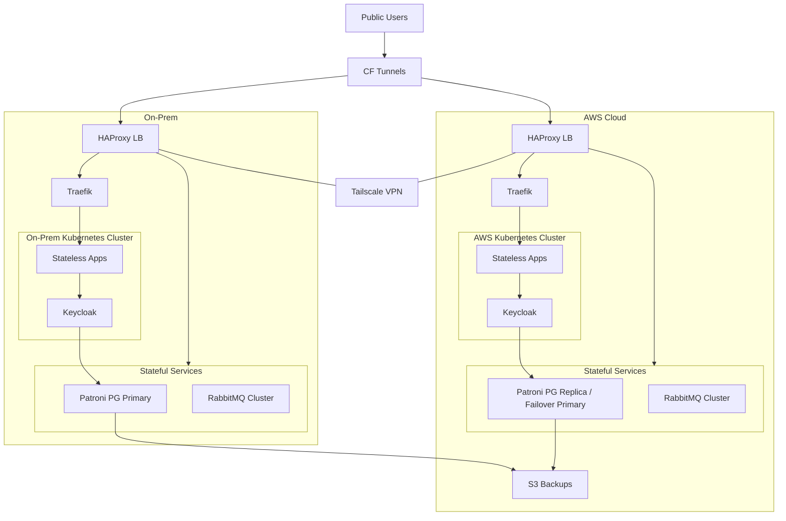

# Architecture

```mermaid
graph TB
    %% Public
    U[Public Users] --> CF[CF Tunnels]

    %% On-Prem
    subgraph OP[On-Prem]
        HA_OP[HAProxy LB]

        subgraph OP_State[Stateful Services]
            OP_PG[Patroni PG Primary]
            OP_RMQ[RabbitMQ Cluster]
        end

        OP_Ingress[Traefik]
        subgraph OP_K8s[On-Prem Kubernetes Cluster]
            OP_Apps[Stateless Apps]
            OP_KC[Keycloak]
        end
    end

    %% AWS
    subgraph AWS[AWS Cloud]
        HA_CL[HAProxy LB]
        
        subgraph AWS_State[Stateful Services]
            AWS_PG[Patroni PG Replica / Failover Primary]
            AWS_RMQ[RabbitMQ Cluster]
        end

        AWS_Ingress[Traefik]
        subgraph AWS_K8s[AWS Kubernetes Cluster]
            AWS_Apps[Stateless Apps]
            AWS_KC[Keycloak]
        end

        S3[S3 Backups]
    end

    %% Connectivity
    TNet[Tailscale VPN]
    HA_CL --- TNet
    HA_OP --- TNet

    %% Public traffic
    CF --> HA_OP
    CF --> HA_CL


    HA_OP --> OP_State
    HA_OP --> OP_Ingress

    HA_CL --> AWS_State
    HA_CL --> AWS_Ingress

    OP_Ingress --> OP_Apps
    AWS_Ingress --> AWS_Apps

    %% Keycloak inside clusters
    OP_Apps --> OP_KC
    AWS_Apps --> AWS_KC

    %% Stateful service replication
    %% OP_PG -- "Sync Replication" --- AWS_PG
    %% OP_RMQ -- "Federation" --- AWS_RMQ

    %% Keycloak -> Postgres
    OP_KC --> OP_PG
    AWS_KC --> AWS_PG

    %% Backups
    OP_PG --> S3
    AWS_PG --> S3
```
## On-premise Cluster
```mermaid

```
## Cloud Cluster