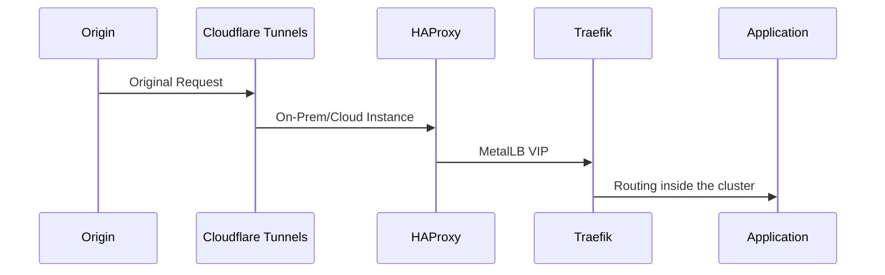
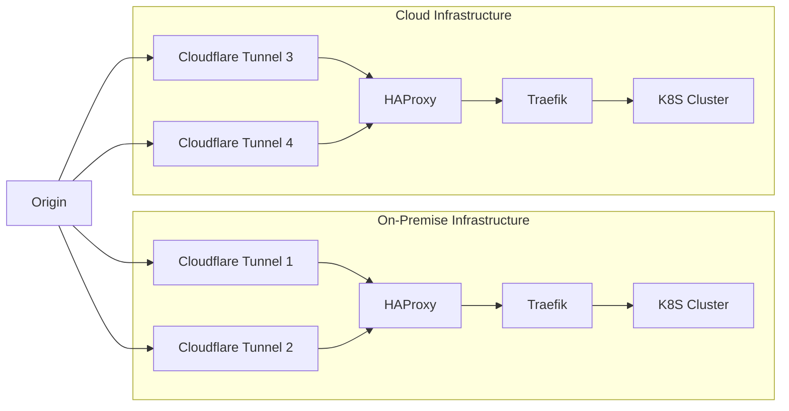

# Flow of Traffic
## Sequence

```mermaid
sequenceDiagram
    participant og as Origin
    participant cf as Cloudflare Tunnels
    participant ha as HAProxy 
    participant lb as Traefik
    participant app as Application

    og ->> cf: Original Request

    cf ->> ha: On-Prem/Cloud Instance

    ha ->> lb: MetalLB VIP

    lb ->> app: Routing inside the cluster
```
## Flowchart

```mermaid
flowchart LR
    og[Origin]
    
    subgraph onprem[On-Premise Infrastructure]
        cf_t1[Cloudflare Tunnel 1]
        cf_t2[Cloudflare Tunnel 2]
        op_ha[HAProxy]
        op_lb[Traefik]
        op_app[K8S Cluster]
    end

    subgraph cloud[Cloud Infrastructure]
        cf_t3[Cloudflare Tunnel 3]
        cf_t4[Cloudflare Tunnel 4]
        cl_ha[HAProxy]
        cl_lb[Traefik]
        cl_app[K8S Cluster]
    end

    og --> cf_t1
    og --> cf_t2
    og --> cf_t3
    og --> cf_t4

    cf_t1 --> op_ha
    cf_t2 --> op_ha
    cf_t3 --> cl_ha
    cf_t4 --> cl_ha

    op_ha --> op_lb
    cl_ha --> cl_lb

    op_lb --> op_app
    cl_lb --> cl_app
```