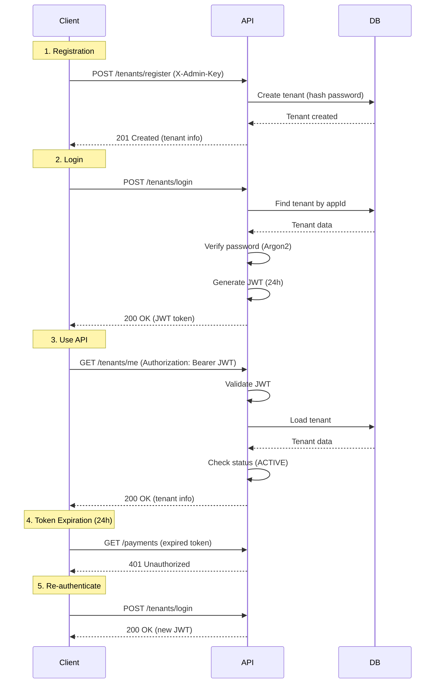

# Tenant API

Manage tenant registration, authentication, and profile updates.

## Endpoints

### Register Tenant {#register}

Create a new tenant account (admin-only).

```http
POST /tenants/register
```

**Authentication**: Admin API Key (`X-Admin-Key` header)

**Request Body**:
```json
{
  "name": "My Product App",
  "appId": "my-app",           // Optional, auto-generated if not provided
  "appSecret": "strong-secret-password",
  "webhookUrl": "https://myapp.com/webhooks/billing"  // Optional
}
```

**Parameters**:

| Field | Type | Required | Description |
|-------|------|----------|-------------|
| `name` | string | Yes | Tenant display name (1-255 chars) |
| `appId` | string | No | Application identifier (alphanumeric + hyphens, unique) |
| `appSecret` | string | Yes | Strong password (min 12 chars) |
| `webhookUrl` | string | No | URL for billing webhooks (valid URL) |

**Response** (201 Created):
```json
{
  "id": "550e8400-e29b-41d4-a716-446655440000",
  "appId": "my-app",
  "name": "My Product App",
  "webhookUrl": "https://myapp.com/webhooks/billing",
  "status": "ACTIVE",
  "createdAt": "2024-01-01T00:00:00.000Z",
  "updatedAt": "2024-01-01T00:00:00.000Z"
}
```

**Errors**:

| Code | Message | Cause |
|------|---------|-------|
| 400 | Validation failed | Invalid request body |
| 401 | Unauthorized | Missing or invalid X-Admin-Key |
| 409 | Conflict | appId already exists |

**Example**:
```bash
curl -X POST http://localhost:3000/tenants/register \
  -H "Content-Type: application/json" \
  -H "X-Admin-Key: your-admin-key" \
  -d '{
    "name": "Test App",
    "appId": "test-app",
    "appSecret": "super-secret-password-123",
    "webhookUrl": "https://example.com/webhook"
  }'
```

---

### Login {#login}

Authenticate and receive JWT access token.

```http
POST /tenants/login
```

**Authentication**: None (public endpoint)

**Request Body**:
```json
{
  "appId": "my-app",
  "appSecret": "strong-secret-password"
}
```

**Parameters**:

| Field | Type | Required | Description |
|-------|------|----------|-------------|
| `appId` | string | Yes | Application identifier |
| `appSecret` | string | Yes | Application secret |

**Response** (200 OK):
```json
{
  "accessToken": "eyJhbGciOiJIUzI1NiIsInR5cCI6IkpXVCJ9.eyJzdWIiOiI1NTBlODQwMC1lMjliLTQxZDQtYTcxNi00NDY2NTU0NDAwMDAiLCJhcHBJZCI6Im15LWFwcCIsImlhdCI6MTcwNDEyMzYwMCwiZXhwIjoxNzA0MjEwMDAwfQ.signature",
  "expiresIn": "24h",
  "tokenType": "Bearer"
}
```

**Token Payload**:
```json
{
  "sub": "550e8400-e29b-41d4-a716-446655440000",  // Tenant ID
  "appId": "my-app",
  "iat": 1704123600,   // Issued at (Unix timestamp)
  "exp": 1704210000    // Expires at (Unix timestamp)
}
```

**Errors**:

| Code | Message | Cause |
|------|---------|-------|
| 400 | Validation failed | Missing appId or appSecret |
| 401 | Invalid credentials | Wrong appId or appSecret |
| 401 | Tenant suspended | Tenant status is SUSPENDED |
| 401 | Tenant deleted | Tenant status is DELETED |

**Example**:
```bash
curl -X POST http://localhost:3000/tenants/login \
  -H "Content-Type: application/json" \
  -d '{
    "appId": "test-app",
    "appSecret": "super-secret-password-123"
  }'
```

**Response**:
```json
{
  "accessToken": "eyJhbGci...",
  "expiresIn": "24h",
  "tokenType": "Bearer"
}
```

**Using the token**:
```bash
curl -X GET http://localhost:3000/tenants/me \
  -H "Authorization: Bearer eyJhbGci..."
```

---

### Get Current Tenant {#get-current}

Retrieve authenticated tenant information.

```http
GET /tenants/me
```

**Authentication**: JWT required (`Authorization: Bearer <token>`)

**Response** (200 OK):
```json
{
  "id": "550e8400-e29b-41d4-a716-446655440000",
  "appId": "my-app",
  "name": "My Product App",
  "webhookUrl": "https://myapp.com/webhooks/billing",
  "status": "ACTIVE",
  "createdAt": "2024-01-01T00:00:00.000Z",
  "updatedAt": "2024-01-01T00:00:00.000Z"
}
```

**Fields**:

| Field | Type | Description |
|-------|------|-------------|
| `id` | string (UUID) | Unique tenant identifier |
| `appId` | string | Application identifier |
| `name` | string | Tenant display name |
| `webhookUrl` | string \| null | Webhook URL for billing events |
| `status` | string | Tenant status (ACTIVE, SUSPENDED, DELETED) |
| `createdAt` | string (ISO 8601) | Creation timestamp |
| `updatedAt` | string (ISO 8601) | Last update timestamp |

**Errors**:

| Code | Message | Cause |
|------|---------|-------|
| 401 | Unauthorized | Missing or invalid JWT token |
| 401 | Tenant not found | Tenant ID from JWT doesn't exist |
| 401 | Tenant suspended | Tenant status is not ACTIVE |

**Example**:
```bash
curl -X GET http://localhost:3000/tenants/me \
  -H "Authorization: Bearer <your-jwt-token>"
```

---

### Update Current Tenant {#update-current}

Update authenticated tenant information.

```http
PATCH /tenants/me
```

**Authentication**: JWT required

**Request Body**:
```json
{
  "name": "Updated Product App",
  "webhookUrl": "https://newurl.com/webhooks"
}
```

**Parameters** (all optional):

| Field | Type | Description |
|-------|------|-------------|
| `name` | string | Updated tenant name (1-255 chars) |
| `webhookUrl` | string \| null | Updated webhook URL (valid URL or null to remove) |

**Response** (200 OK):
```json
{
  "id": "550e8400-e29b-41d4-a716-446655440000",
  "appId": "my-app",
  "name": "Updated Product App",
  "webhookUrl": "https://newurl.com/webhooks",
  "status": "ACTIVE",
  "createdAt": "2024-01-01T00:00:00.000Z",
  "updatedAt": "2024-01-01T12:00:00.000Z"
}
```

**Notes**:
- Cannot update `appId` (immutable)
- Cannot update `appSecret` via this endpoint (security)
- Cannot update `status` (admin action only)

**Errors**:

| Code | Message | Cause |
|------|---------|-------|
| 400 | Validation failed | Invalid name or webhookUrl format |
| 401 | Unauthorized | Missing or invalid JWT token |

**Example**:
```bash
curl -X PATCH http://localhost:3000/tenants/me \
  -H "Authorization: Bearer <your-jwt-token>" \
  -H "Content-Type: application/json" \
  -d '{
    "name": "New App Name",
    "webhookUrl": "https://new-webhook.com"
  }'
```

**Remove webhook URL**:
```bash
curl -X PATCH http://localhost:3000/tenants/me \
  -H "Authorization: Bearer <your-jwt-token>" \
  -H "Content-Type: application/json" \
  -d '{
    "webhookUrl": null
  }'
```

---

## Tenant Status

Tenants can have one of three statuses:

### ACTIVE

- Can authenticate and receive JWT
- Can make API calls
- Can create payments
- Receives webhook events

### SUSPENDED

- Cannot authenticate (401 Unauthorized)
- Existing JWTs are rejected
- Cannot make API calls
- Data is preserved
- Can be reactivated by admin

**Use cases**:
- Non-payment of fees
- Terms of service violation
- Temporary suspension for investigation

### DELETED

- Cannot authenticate (401 Unauthorized)
- Existing JWTs are rejected
- Cannot make API calls
- Soft delete (data preserved for audit)
- Cannot be reactivated (create new tenant instead)

**Use cases**:
- Tenant requests account deletion
- Long-term suspension

---

## Authentication Flow



---

## Security Best Practices

### For Administrators

1. **Admin API Key**:
   - Use strong, random keys (minimum 32 characters)
   - Store in environment variables (never commit to git)
   - Rotate periodically
   - Use different keys for dev/staging/production

2. **Tenant Registration**:
   - Verify tenant legitimacy before registration
   - Enforce strong appSecret requirements
   - Monitor for suspicious registration patterns

### For Tenants

1. **Credentials**:
   - Keep `appId` and `appSecret` secure
   - Never commit credentials to version control
   - Use environment variables or secret management
   - Rotate `appSecret` periodically (admin action)

2. **JWT Tokens**:
   - Store tokens securely (never in localStorage if possible)
   - Use httpOnly cookies when possible
   - Refresh before expiration (24h)
   - Implement token refresh logic

3. **Webhook URL**:
   - Use HTTPS only
   - Validate webhook signatures
   - Implement idempotency for webhook handlers

---

## Example Integration

### Node.js Client

```typescript
import axios from 'axios';

class BillingClient {
  private baseUrl = 'http://localhost:3000';
  private accessToken: string | null = null;

  async login(appId: string, appSecret: string): Promise<void> {
    const response = await axios.post(`${this.baseUrl}/tenants/login`, {
      appId,
      appSecret,
    });

    this.accessToken = response.data.accessToken;
  }

  async getCurrentTenant(): Promise<any> {
    if (!this.accessToken) {
      throw new Error('Not authenticated');
    }

    const response = await axios.get(`${this.baseUrl}/tenants/me`, {
      headers: {
        Authorization: `Bearer ${this.accessToken}`,
      },
    });

    return response.data;
  }

  async updateTenant(updates: { name?: string; webhookUrl?: string }): Promise<any> {
    if (!this.accessToken) {
      throw new Error('Not authenticated');
    }

    const response = await axios.patch(`${this.baseUrl}/tenants/me`, updates, {
      headers: {
        Authorization: `Bearer ${this.accessToken}`,
        'Content-Type': 'application/json',
      },
    });

    return response.data;
  }
}

// Usage
const client = new BillingClient();
await client.login('my-app', 'my-secret');
const tenant = await client.getCurrentTenant();
console.log(tenant);
```

---

## See Also

- [API Overview](.)
- [Health Check API](./health)
