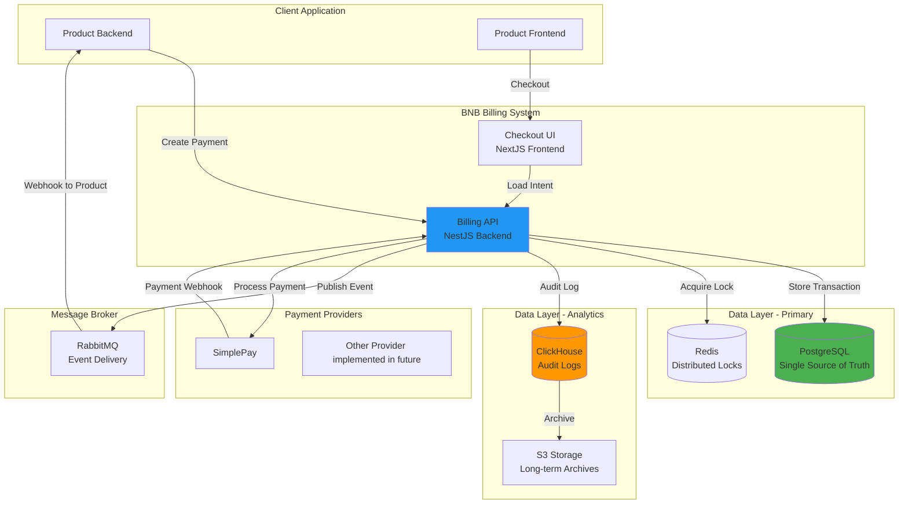

# System Components

BNB Billing System is built on a robust, enterprise-grade architecture designed for financial reliability and regulatory compliance.

## System Overview

## Core Components

The BNB Billing System consists of several key components working together:

- **Billing API** (NestJS Backend): The central nervous system that processes payments, manages authentication, and handles provider integrations
- **Checkout UI** (NextJS Frontend): Secure, PCI-compliant checkout experience for end users
- **PostgreSQL**: Primary database containing all financial records (single source of truth)
- **Redis**: Distributed coordination for locks, caching, and rate limiting
- **ClickHouse**: Immutable audit logs for compliance and analytics
- **RabbitMQ**: Guaranteed event delivery to tenant applications
- **S3 Storage**: Long-term archives for compliance documentation

:::tip Detailed Information
For comprehensive details about each component, see:
- [Architecture Overview](./core/architecture) - Complete system architecture and component details
- [Traffic Flow](./core/traffic) - How data flows through the system
:::

## Data Flow

The system handles two main data flows:

1. **Payment Creation**: From your application through the Billing API to payment providers
2. **Webhook Processing**: From payment providers back to your application via RabbitMQ

:::tip Detailed Flows
See [Traffic Flow](./core/traffic) for detailed sequence diagrams of payment creation and webhook processing.
:::

## Related Documentation

For detailed information about specific aspects of the system:

### Core Architecture
- [Architecture Overview](./core/architecture) - Complete system architecture, components, and data storage
- [Traffic Flow](./core/traffic) - Payment flows and webhook processing

### Performance & Reliability
- [Security](./performance/security) - Security architecture and defense in depth
- [Reliability](./performance/reliability) - Reliability guarantees and disaster recovery
- [Auditing](./performance/auditing) - Audit logging and compliance
- [Monitoring](./performance) - Monitoring, observability, and alerting

---

:::tip Contact
If you have any questions regarding the system and your personal data, please feel free to contact us at contact@bnbdevelopment.hu.
:::