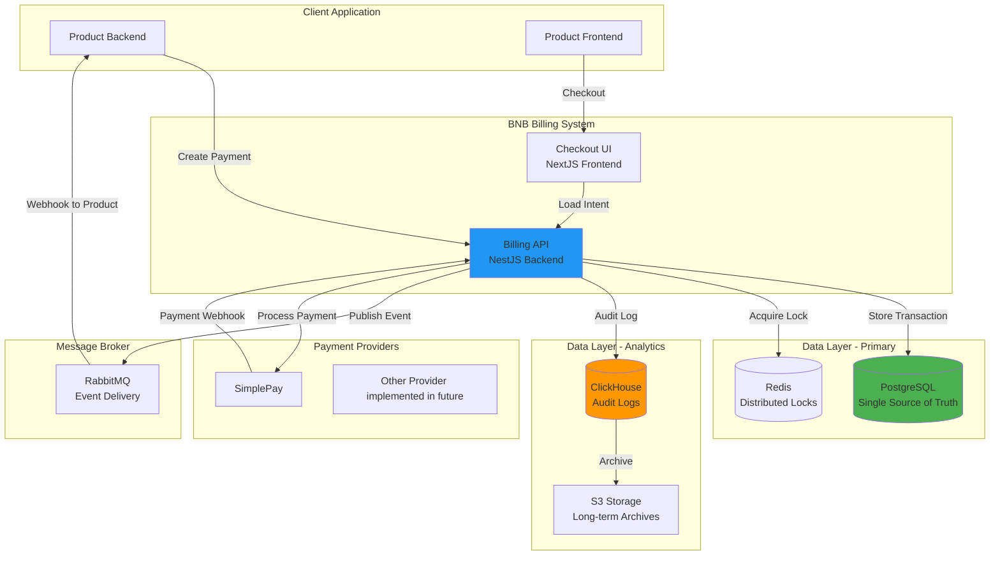
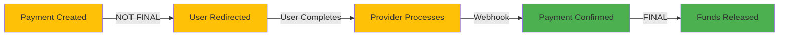
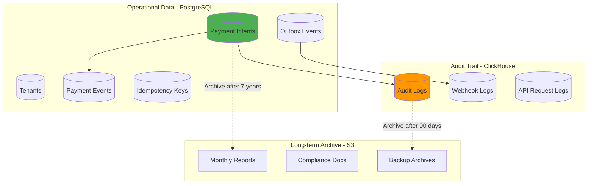
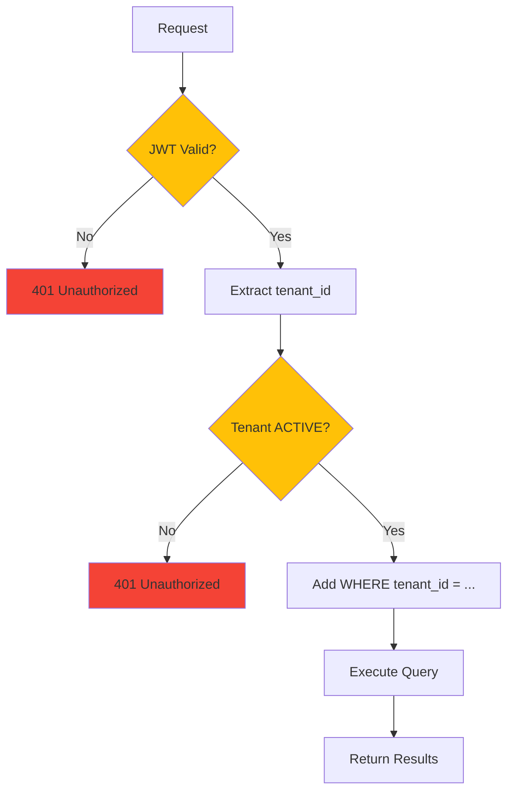

# Architecture Overview

BNB Billing System is built on a robust, enterprise-grade architecture designed for financial reliability and regulatory compliance. The system is designed around three core principles: **Financial Accuracy**, **Regulatory Compliance**, and **Zero Payment Loss**.

## System Overview



## Core Components

### Billing API (NestJS Backend)

The central nervous system of the platform.

**Responsibilities**:
- Process payment requests from tenant applications
- Manage multi-tenant authentication (JWT)
- Enforce idempotency to prevent duplicate charges
- Communicate with payment providers
- Handle provider webhooks
- Publish events to tenant applications
- Maintain complete audit trail

**Technology**: NestJS (Node.js), TypeScript

**Deployment**: Kubernetes pods with auto-scaling

**Availability**: Active-active cluster across 3 availability zones

**Key Features**:
- JWT authentication with Argon2id password hashing
- Two-tier idempotency (Redis + PostgreSQL)
- Real-time health monitoring

### Checkout UI (NextJS Frontend)

Secure, PCI-compliant checkout experience.

**Responsibilities**:
- Validate checkout tokens
- Display payment details to end users
- Redirect to payment provider
- Handle return URLs after payment

**Technology**: NextJS, React, TypeScript

**Security**:
- Short-lived checkout tokens (5 minutes)
- No sensitive card data stored
- HTTPS-only, HSTS enabled

:::info PCI Compliance
The Checkout UI never touches card data. All payment information is collected directly by certified payment providers (SimplePay, Stripe, PayPal).
:::

## Design Principles

### 1. Single Source of Truth

**PostgreSQL is the ONLY authoritative source for payment state.**

:::danger Critical Rule
Redis, caches, and message queues may temporarily store data for performance, but PostgreSQL is always the final arbiter of truth. If systems disagree, PostgreSQL wins.
:::

**Why this matters**:
- No ambiguity during failures
- Simplified disaster recovery
- Clear audit trail
- Regulatory compliance

### 2. Event-Driven Confirmation

**Payments are only confirmed after verified provider webhooks.**



**Never trust**:
- Frontend redirects (user can manipulate URL)
- User claims (fraud risk)
- Provider UI screenshots (easily faked)

**Always trust**:
- Cryptographically signed webhooks
- Provider APIs with authentication
- Database records

### 3. Idempotency Everywhere

**Every operation can be safely retried without side effects.**

| Operation | Idempotency Method | Result |
|-----------|-------------------|--------|
| Payment Creation | Idempotency-Key header | Same key = same payment |
| Webhook Processing | Provider event ID | Duplicate webhook ignored |
| Event Publishing | Outbox pattern | Delivered exactly once |
| Tenant Webhooks | Event UUID | Your app receives once |

**Example**: Network timeout during payment creation
```
Request 1: Create payment (timeout, no response)
Request 2: Create payment (same Idempotency-Key)
Result: Second request returns EXISTING payment, no duplicate charge
```

## Architecture Layers

### Layer 1: API Gateway

**Purpose**: Single entry point for all requests

**Responsibilities**:
- SSL/TLS termination
- Rate limiting (100 req/min per tenant)
- DDoS protection
- Request routing
- Health check proxying

**Technology**: NGINX with ModSecurity WAF

### Layer 2: Application Layer

**Purpose**: Business logic and orchestration

**Components**:
- **Billing API** (NestJS): Process payments, authenticate tenants
- **Checkout UI** (NextJS): User-facing payment interface
- **Background Workers** (NestJS): Process outbox, handle retries

**Stateless Design**:
- No session storage on servers
- JWT for authentication (self-contained)
- Can scale horizontally without coordination
- Any pod can handle any request

### Layer 3: Data Layer

**Purpose**: Persistent storage and coordination

**Components**:

| Component | Purpose | Data Type | Durability |
|-----------|---------|-----------|------------|
| **PostgreSQL** | Financial records | Structured, relational | ACID guaranteed |
| **Redis** | Distributed locks, cache | Key-value | Optional persistence |
| **ClickHouse** | Audit logs, analytics | Columnar, append-only | Immutable |
| **RabbitMQ** | Event distribution | Messages, queues | Disk-backed |
| **S3** | Long-term archives | Object storage | 99.999999999% |

#### PostgreSQL - Primary Database

Primary database containing all financial records.

**What We Store**:
- Payment intents and their complete lifecycle
- Tenant accounts and authentication data
- Idempotency records (24-hour retention)
- Webhook delivery logs
- Event outbox for guaranteed delivery

**Guarantees**:
- ACID transactions (Atomicity, Consistency, Isolation, Durability)
- Automated hourly backups with 30-day retention
- Encrypted at rest (AES-256)

**Retention Policy**:
- Payment records: **7 years minimum** (legal requirement)
- Audit logs: **7 years minimum**
- Idempotency keys: **24 hours**
- Webhook logs: **90 days**

#### Redis - Distributed Coordination

High-performance in-memory store for operational data.

**Use Cases**:
1. **Distributed Locking**: Prevents concurrent duplicate requests
   - Lock timeout: 30 seconds
   - Automatic lock expiration prevents deadlocks

2. **Caching**: Improves response time for frequently accessed data
   - Tenant authentication data (1 hour TTL)
   - Payment provider configurations

3. **Rate Limiting**: Protects against abuse
   - 100 requests per minute per tenant
   - Configurable limits per endpoint

**Guarantees**:
- &lt;1ms latency for lock operations
- Redis Sentinel for automatic failover
- Persistence enabled (AOF + RDB)

:::warning No Financial Data in Redis
Redis is used only for operational data. All financial records are stored exclusively in PostgreSQL.
:::

#### ClickHouse - Immutable Audit Logs

High-performance columnar database for analytics and compliance.

**What We Store**:
- Every payment state transition
- All API requests and responses
- Webhook payloads (raw and parsed)
- Authentication events
- System errors and warnings

**Guarantees**:
- **Append-only**: Logs cannot be modified or deleted
- **Fast queries**: Billion-row queries in &lt;1 second
- **Data retention**: Indefinite (legal compliance)
- **Tamper-evident**: Cryptographic checksums

**Use Cases**:
- Regulatory audits
- Fraud investigation
- Business intelligence
- Incident forensics

#### S3 Storage - Long-term Archives

Object storage for cold data and compliance.

**What We Store**:
- Monthly financial reports
- Archived webhook payloads (>90 days)
- System backups
- Compliance documentation

**Retention**: 7+ years, lifecycle policies for cost optimization

#### RabbitMQ - Guaranteed Event Delivery

Enterprise message broker for reliable event distribution.

**Use Cases**:
1. **Tenant Webhooks**: Notify your application of payment events
   - payment.succeeded
   - payment.failed
   - payment.refunded

2. **Internal Events**: Coordinate between microservices
   - Send invoices after successful payment
   - Update analytics dashboards
   - Trigger fraud detection

**Guarantees**:
- **At-least-once delivery**: Events never lost
- **Ordering**: FIFO within a tenant
- **Retry logic**: Exponential backoff for failed deliveries
- **Dead letter queue**: Capture permanently failed events

**Outbox Pattern**:
We use the Transactional Outbox Pattern to ensure event reliability:
1. Write event to PostgreSQL in same transaction as state change
2. Background worker publishes to RabbitMQ
3. Mark as delivered only after broker confirmation
4. Guaranteed no lost events, even during crashes

### Layer 4: Integration Layer

**Purpose**: Communication with external systems

**Integrations**:
- **Payment Providers** (SimplePay, Stripe, PayPal)
- **Tenant Webhooks** (Your application)
- **Monitoring** (Prometheus, Grafana)
- **Alerting** (PagerDuty, Slack)

## Data Architecture

### Payment Lifecycle Storage



### Database Schema (Simplified)

#### payment_intents
**Purpose**: Core payment records

| Field | Type | Description |
|-------|------|-------------|
| `id` | UUID | Unique payment identifier |
| `tenant_id` | UUID | Which application owns this |
| `user_id` | String | End user identifier |
| `amount` | Integer | Amount in smallest currency unit (fillér, cents) |
| `currency` | Enum | HUF, EUR, or USD |
| `status` | Enum | created → provider_pending → succeeded/failed |
| `provider` | String | simplepay, stripe, paypal |
| `provider_reference` | String | Provider's payment ID |
| `created_at` | Timestamp | When payment was initiated |
| `expires_at` | Timestamp | When payment becomes invalid |

**Indexes**:
- Primary key on `id`
- Index on `tenant_id, status` (for queries)
- Index on `provider_reference` (for webhooks)
- Index on `created_at` (for reporting)

#### payment_events
**Purpose**: Immutable audit trail of state changes

| Field | Type | Description |
|-------|------|-------------|
| `id` | UUID | Event identifier |
| `payment_intent_id` | UUID | Which payment this event belongs to |
| `event_type` | Enum | created, succeeded, failed, refunded, etc. |
| `from_status` | Enum | Previous status (null if creation) |
| `to_status` | Enum | New status |
| `metadata` | JSONB | Event-specific data |
| `created_at` | Timestamp | When event occurred |

**Rules**:
- Append-only (no updates or deletes)
- Complete history of payment lifecycle
- Used for debugging and compliance

#### tenants
**Purpose**: Multi-tenant isolation and authentication

| Field | Type | Description |
|-------|------|-------------|
| `id` | UUID | Tenant identifier |
| `app_id` | String | Human-readable application ID |
| `app_secret_hash` | String | Argon2id password hash |
| `name` | String | Display name |
| `webhook_url` | String | Where to send payment events |
| `status` | Enum | ACTIVE, SUSPENDED, or DELETED |

**Security**:
- `app_secret` never stored (only Argon2id hash)
- JWT tokens contain `tenant_id` for all operations
- All queries filtered by `tenant_id` (prevents cross-tenant access)

#### idempotency_keys
**Purpose**: Prevent duplicate operations

| Field | Type | Description |
|-------|------|-------------|
| `id` | UUID | Record identifier |
| `key` | String | Composite key: `{tenant}:{operation}:{client_key}` |
| `tenant_id` | UUID | Tenant isolation |
| `request_hash` | String | SHA-256 of request (detects payload changes) |
| `response` | JSONB | Cached response for replay |
| `created_at` | Timestamp | When key was first seen |
| `expires_at` | Timestamp | When key becomes invalid (24 hours) |

**How it works**:
1. Client sends `Idempotency-Key: abc123` header
2. Server generates hash of request body
3. Check if key exists with matching hash
4. If exists: return cached response (200 OK)
5. If not: execute request, cache response, return (201 Created)
6. If exists with DIFFERENT hash: return 409 Conflict (security issue)

## Security Architecture

### Multi-Tenant Isolation



**Enforcement Points**:
1. **Authentication**: JWT contains `tenant_id`
2. **Authorization**: All queries filter by `tenant_id`
3. **Data Layer**: PostgreSQL row-level security (future)
4. **Audit**: ClickHouse logs all cross-tenant attempts

:::tip Security Details
For detailed security architecture information, see [Security](../performance/security).
:::

## Failure Handling

### Scenario 1: Database Failure

**What happens**:
- Health check fails
- Kubernetes removes pod from load balancer
- No new requests routed to failed pod
- Active requests may fail (clients should retry)

**Recovery**:
- PostgreSQL auto-failover to standby (30 seconds)
- Kubernetes spawns new pod
- Health check passes
- Pod added back to load balancer

### Scenario 2: Payment Provider Failure

**What happens**:
- SimplePay returns 500 error
- Payment status remains in `CREATED`
- Error logged to ClickHouse
- Client receives 503 Service Unavailable

**Recovery**:
- Client retries with same Idempotency-Key
- Idempotency system ensures no duplicate payment
- If SimplePay recovered: payment proceeds
- If SimplePay still down: return same error

### Scenario 3: Webhook Delivery Failure

**What happens**:
- Payment succeeds with provider
- Webhook to tenant application fails (500 error)
- Event written to outbox table
- Background worker retries with exponential backoff

**Retry Schedule**:
- Attempt 1: Immediate
- Attempt 2: 5 seconds
- Attempt 3: 25 seconds
- Attempt 4: 2 minutes
- Attempt 5: 10 minutes
- Attempts 6-10: 1 hour apart
- After 10 failures: Alert sent to support

## Compliance Architecture

### GDPR Requirements

| Requirement | Implementation |
|-------------|----------------|
| Right to Access | API endpoint to export all user data |
| Right to Erasure | Pseudonymization after 7 years (compliance) |
| Data Portability | JSON export of all payment records |
| Breach Notification | Automated alerts within 1 hour of detection |
| Data Minimization | Only collect required payment fields |
| Purpose Limitation | Payment data not used for marketing |

### Financial Record Retention

Hungarian Accounting Act requires **7-year minimum retention** for:
- Payment records
- Invoices
- Transaction logs
- Audit trails

**Our implementation**:
- PostgreSQL: Retain payment_intents for 7 years
- ClickHouse: Retain audit_logs indefinitely
- S3: Archive monthly reports for 10 years
- Backups: Retain for 30 days (rolling)

---

:::tip Deep Dive
Want to understand specific architectural decisions? Check out:
- [Traffic Flow](./traffic) - How payments move through the system
- [System Components](../components) - System component overview
- [Security](../performance/security) - Security architecture deep dive
- [Reliability](../performance/reliability) - Reliability and fault tolerance
:::