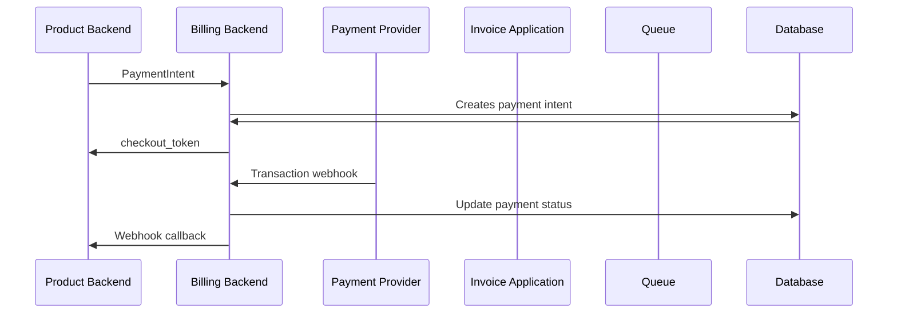

# Traffic Flow

Documentation about the general concepts and flow of traffic throughout the applications.

## Payment flow

### Payment intent creation (server-to-server)
1. Product backend communicates with billing backend, which creates a `PaymentIntent` entry in database.
2. Billing backend creates the `payment_intent_id` and sends back the `checkout_token`.
3. Product redirects to the checkout URL

### User checkout (frontend)
4. The User is redirected to Billing frontend (Next.js), where the token is validated, checkout page loads payment intent details from database. 
5. Billing backend creates payment provider specific intent, frontend redirects user to the provider payment page

### Payment confirmation
6. Payment provider to Billing backend (webhook): verifying the status of the transaction. Billing backend updates the status based on that. 
7. Billing backend sends request to the given product, with the status of the transaction.

### Full Flow
