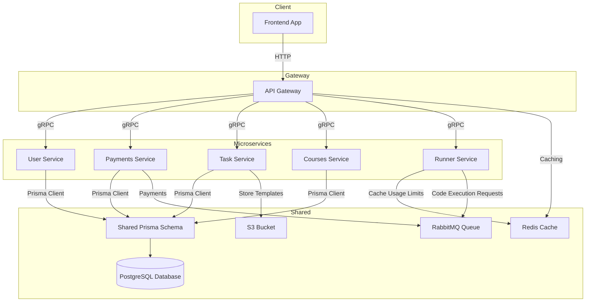

# Architecture
## Architecture Diagram

## Services
The application consists of the following microservices:
- **User Service**: is responsible for handling user data, like scores, emails and updating the meta-data in the database.
- **Payments Service**: responsible for handling payments and subscriptions
- **Task Service**: responsible for generating the desired tasks for the users. It fetches the template file, generates a JSON task description and solution, provides code snippets when necessary, and also handles the validation of a task solution.
- **Courses Service**: responsible for creating, managing, deleting courses from the site.
- **Runner Service**: instructed by task service, handles user code session, ensures usage limits, and instructs certain code snippets to be executed in an isolated environment

### External Services
- **PostgreSQL**: main database, storing all of the imporant artifacts regarding the application. Used by all microservices.
- **Redis**: caching solution, also stores the usage limits / cooldowns of users, timeouts.
- **S3**: persistent storage solution, houses all task files defined in `.yaml` and also video content.
- **RabbitMQ**: main queue solution, mostly used for handling code execution requests and processing subscriptions.
