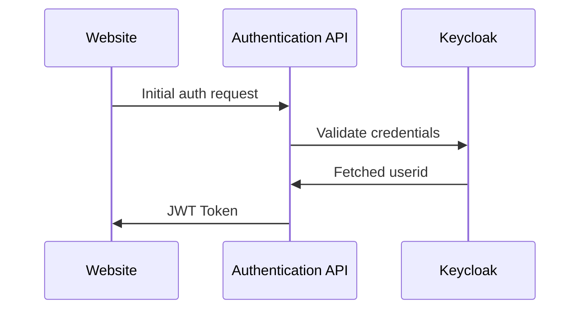

This sections sums up the way authentication and user management works.

## Authentication Flow
 

```mermaid
sequenceDiagram
    participant web as Website
    participant api as Authentication API
    participant kc as Keycloak
    web ->> api: Initial auth request
    api ->> kc: Validate credentials
    kc ->> api: Fetched userid
    api ->> web: JWT Token 
```