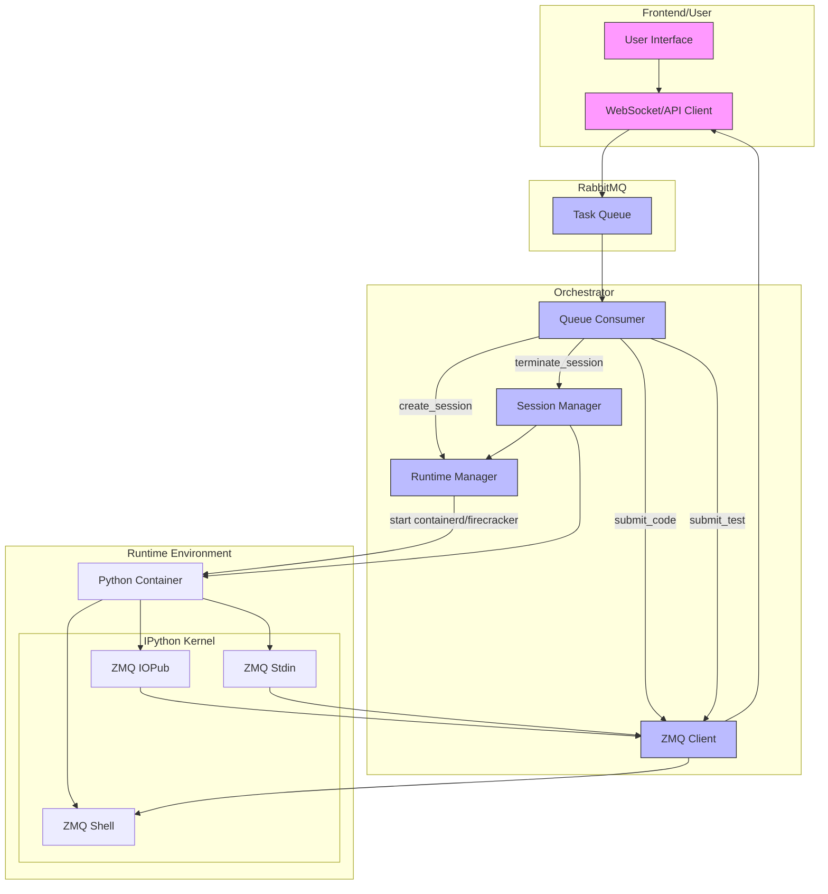

BNB CodeRunner is an open-source container orchestration architecture. It is responsbile for creating, managing and deleting user runtimes, enabling code execution in web environments.

## Architecture
- **Orchestrator**: an application written in Go, responsible for creating, managing, terminating code running environments. It deploys a custom Python image embedded with the IPython Kernel.
- **IPython Kernel**: serves as the computational engine to execute code.
- **RabbitMQ Queue**: every code execution request submitted by the user creates an event in the queue. Premium users will have higher priority in the queue.
- **ZeroMQ**: embeddable networking library / concurrency framework, responsible for the communication between the user and code environment.

