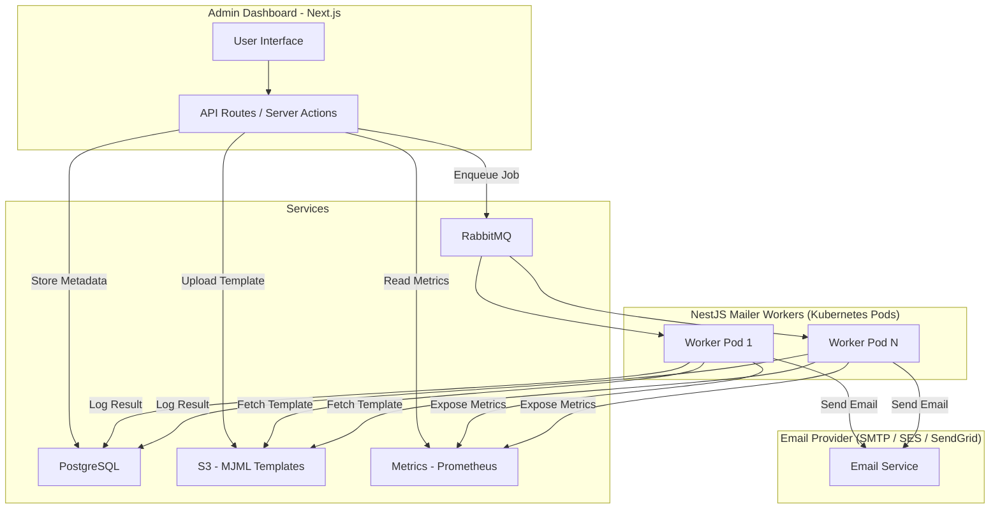

# Components
SimpleMailer consists of two application:
- **Dashboard**: an optional website to view information about the system, jobs and queues. 
- **Worker**: nodes listening to the queue events and executing the jobs.

## Architecture

## External services
- **PostgreSQL Database**: the main database where all logs, accounts and templates are stored.
- **RabbitMQ Queue**: the main queue which ensures that all mail jobs are executed successfully.
- **S3 Bucket** *(optional)*: can store all the templates in an S3 compatible bucket. Not neccessary, but highly recommended.